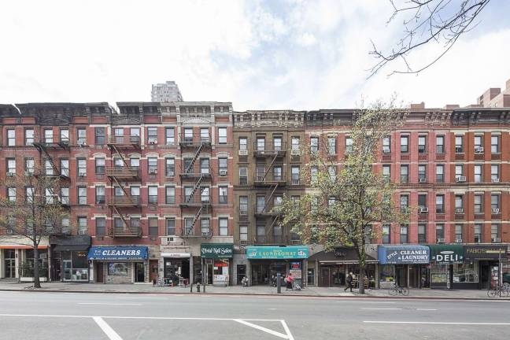

**NYT December 8th 1992**

**Behind the Facade, a Building Divided**
===
For 108 years, the four-story Montgomery Block has been an ample
presence on East 86th Street, as well as an architectural symbol of 
an almost vanished Yorkville, with the Kleine Konditorei restaurant 
on the ground floor, delicate ornamentation and a powerful cornice 
above.

Until now. Tenants figured out something was about to happen last 
Monday when they were surrounded by scaffolding. "You couldn't 
see down to the street anymore," said Kathleen Murtha, whose 
mother, Mary, has lived in the Montgomery for 40 years.

"They didn't tell us anything," Ms. Murtha said. "It just went up." 
Falling Debris

Then came Saturday morning. Fredy K. Seidel, a systems analyst 
who has lived downstairs from Mrs. Murtha since 1976, said: 
"They started tearing down at 7:30. The building was shaking like 
an earthquake. They were banging on the roof like crazy. Bits and 
pieces of debris were falling."

It turns out that the Montgomery -- which appears to be a single 
apartment house, with a common facade, a common history and a 
common owner -- is technically six separate structures. And the 
owners have received permission to raze three unoccupied 
structures from the second floors up, leaving something that may 
look like a gap-toothed smile, with empty holes between three 
occupied portions.

Edward Teplitz of Manhattan, one of the owners, declined to 
describe his plans for the site. "Our plans are to do the work we 
have permits for," he said.

Preservationists are already mourning the loss of "one of the few 
intact sections of what was old Yorkville," said Britt Densmore, 
executive director of the Friends of the Upper East Side Historic 
Districts.

The undertaking has been judged a "feasible" engineering project 
by the New York City Buildings Department, which has issued 
demolition permits for the second through fourth floors of Nos. 232, 
236 and 238 East 86th Street, which are vacant. A Home Taken 
Apart

Meanwhile, seven tenants remain in the Montgomery, at Nos. 230, 
234 and 240, according to Mrs. Murtha. They will be watching their 
home taken apart.

No matter what the records say, occupants regard the Montgomery 
as a whole. "They're listed separately, but they're really one unit," 
Mr. Seidel said. They even share a boiler, water system and electric 
meters, he said.

"It's a single building from 230 to 240," said Hans Hoeft, owner of 
Kleine Konditorei. "I think so."

But the buildings agency agrees with the owner, and regards the 
structures separately. "There doesn't seem to be a problem, as far 
as we can see," said Vahe Tiryakian, the department spokesman. 
"We asked our engineers if this is feasible, because the buildings 
have common party walls. 'Yes,' they said, 'it can be done.' " He 
said that was because the walls of the occupied buildings would be 
braced from the outside during the work.

Mr. Tiryakian said the owners' engineer, identified in city records 
as Robert Rosenwasser of Manhattan, filed a form in which he 
"accepts responsibility for the structural stability of the buildings 
as the work progresses." This was countersigned by Mr. Teplitz.

The job was halted briefly on Saturday, Mr. Tiryakian said, but only 
because the wrecking crew did not have a permit for weekend 
work.

For his part, Mr. Teplitz said, "We went through the process, we got 
the permits and we're doing it according to the rules and 
regulations of the city."

He added, "We're certainly aware that there are tenants in some of 
the buildings" and said there were no plans to move the 
tenants out.

And though he was startled by this turn in the Montgomery's 
history, Mr. Seidel said he did not blame the owners.

"For the most part, they've been all right as landlords," Mr. Seidel 
said. "They haven't harassed anyone. It's obvious that they're 
trying to vacate the building and that's their right. If I get the right 
offer, who knows? They haven't been your typical slumlords, in all 
fairness.

"It's just that this is coming very suddenly and very surprisingly."

